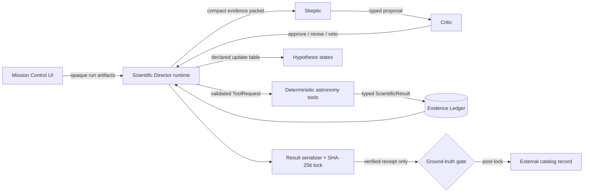

# ExoSwarm architecture

ExoSwarm is deliberately split at the scientific-authority boundary. The model may choose one
experiment from a bounded registry. It cannot execute Python, see raw arrays, mutate state, access
catalog truth, or author a measurement. The deterministic runtime owns every transition.



## Package boundaries

- `exoswarm.domain`: provider-neutral Pydantic contracts, hash-chained ledger and trace, experiment
  registry, evidence-update table, categorical disposition rules, and numerical-provenance guard.
- `exoswarm.science`: FITS/NPZ/plot handling and deterministic Astropy/NumPy/SciPy diagnostics. It
  imports the domain contracts but never imports the catalog/security package.
- `exoswarm.agents`: one provider interface, strict structured-output harness, compact context
  builder, Skeptic and Critic objectives, declared fallback policies, and prose guardrails. It has
  no science executor or catalog capability.
- `exoswarm.security`: opaque target vault, result locker, post-lock catalog gate, artifact-order
  verification, and a static import-boundary audit.
- `exoswarm.runtime`: the bounded Director loop. It is the only layer that combines the registry,
  science toolbox, agents, ledger, lock, and reveal capability.
- `exoswarm.ui`: a read-only-by-default mission-control view over validated run artifacts. It does
  not parse cached FITS headers or display unvalidated model responses.
- `exoswarm.evaluation`: outcome/constraint graders and the measured fixed-checklist ablation.

The static security test rejects imports of the catalog/security capability from `agents` or
`science`.

## Runtime state machine

1. The backend registers a private target mapping but gives the investigation an opaque ID.
2. Code executes the mandatory load, quality, normalization, detrending, BLS, fold, signal-quality,
   odd/even, secondary, and basic contamination sequence.
3. Each successful tool result is schema-validated, appended to the Evidence Ledger, hash chained,
   and applied through the declared hypothesis-update table.
4. Once mandatory vetting is complete, the Skeptic receives a small identity-safe packet and
   requests one available adaptive experiment or `STOP`. The packet includes bounded parameter
   contracts; application code binds the current deterministic candidate ID and ephemeris.
5. The Critic independently returns `APPROVE`, one `REVISE`, or `VETO`. There is no recursive agent
   conversation.
6. The registry validates parameters, prerequisites, data-product availability, repeat limits,
   experiment budget, and lock state before deterministic execution.
7. The loop stops on sufficient evidence, a declared stop, repetition, failure, or a hard budget.
8. The final categorical result is serialized and SHA-256 hashed. Only a verified receipt enables
   the catalog gate; the reveal is a separate immutable artifact.

## Failure policy

Every model response is schema-validated. A narrowly recognized provider-envelope defect may be
repaired locally and is labeled `REPAIRED_LIVE_MODEL`; other invalid output receives one repair
call. A second failure activates a deterministic, explicitly traced safe policy. Every decision is
classified as `LIVE_MODEL`, `REPAIRED_LIVE_MODEL`, or `DETERMINISTIC_FALLBACK`. Invalid tool
parameters never reach the science layer. Tool preconditions return typed failures with
alternatives. No exception silently turns into an arbitrary scientific result.

## Context and numerical provenance

Agent packets contain the opaque ID, one compact candidate, evidence codes and ledger-backed
measurements, hypothesis states, available experiments, and remaining budgets. They exclude source
paths, raw time/flux arrays, pixel cubes, backend mapping handles, recognizable target identifiers,
and catalog values.

Before each provider call, a recursive context preflight rejects prohibited catalog/identity fields,
recognizable TIC/TOI identifiers, and raw-array keys. The trace stores only a SHA-256 packet digest,
evidence IDs, permitted/completed experiment names, lock state, and proposal metadata—not the full
prompt or model response.

Model-authored user-facing prose is mechanically checked against ledger measurements. Unsupported
numbers are replaced before they enter the trace/UI. TIC/TOI-like identifiers guessed by a model
are also withheld until reveal. Decision-utility values are labeled as uncalibrated experiment
selection signals, never planet probabilities.

## Persistent run contract

```text
runs/TARGET-X17/
  artifacts/artifacts.json
  artifacts/science/*.npz
  artifacts/science/*.png
  evidence.jsonl
  trace.jsonl
  result.json
  result.json.sha256
  reveal.json                 # optional; necessarily post-lock
```

`evidence.jsonl` and `trace.jsonl` are hash chained. `result.json` has no field capable of carrying
real identity or catalog status. `reveal.json` references the exact locked-result digest and is
rejected if the result/hash pair is missing, changed, or newer than the reveal.
